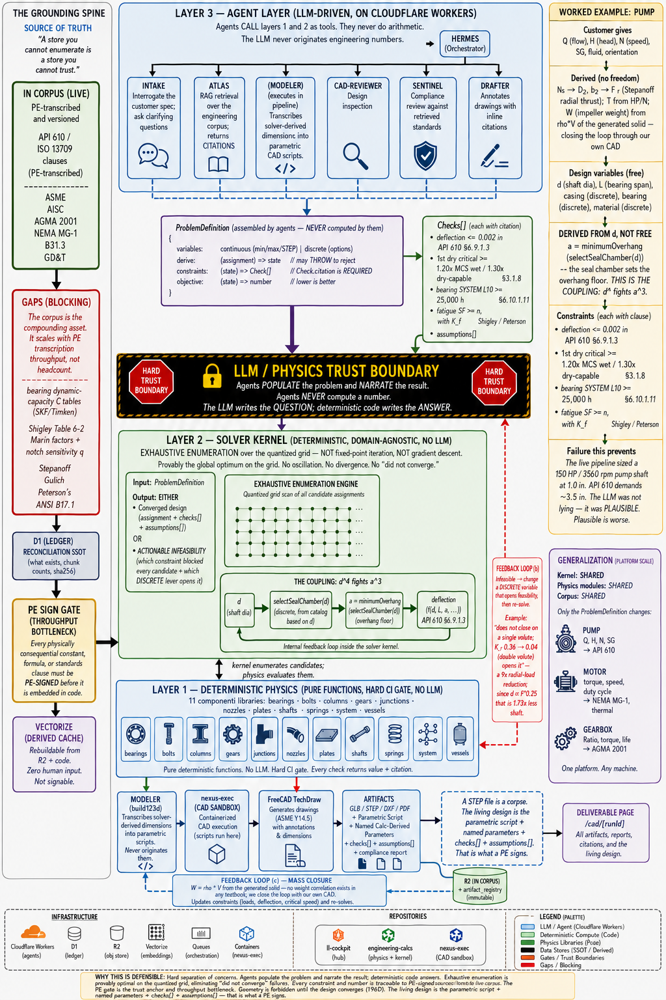

# NEXUS — Calc-Grounded CAD Vertical

> An AI design office that returns PE-signable design packages. Not a chatbot that describes one.



**North star node:** `f8764951-b972-49c4-bedd-6f53fb5438c7` (D1 `sprint_items`, sprint 30, `study_node:north-star`)
Every sprint in the CAD lane is judged against it.

---

## What this is

Take a **customer specification** — flow, head, speed, fluid — and return a complete, **PE-signable design package**: calcs, converged dimensions, parametric 3D model, ASME Y14.5 drawings, BOM, DFM, compliance report.

For any machine. Pump first. Motor, engine, gearbox, pressure vessel after.

## Why it is defensible

Anyone can bolt an LLM to a CAD kernel. Text-to-CAD is a solved demo.

What nobody has is the **grounding layer** — because it cannot be scraped, prompted, or fine-tuned into existence. It has to be *transcribed*, clause by clause, by someone who can sign for it.

An LLM will confidently size a 150 HP / 3560 rpm pump shaft at **1.0 inch**. API 610 demands **~3.5 inches**. The model is not lying — it is **plausible**, which is worse. The moat is the machinery that makes the wrong answer *impossible to emit*: a deflection limit of 0.002 in, cited to API 610 §6.9.1.3, enforced by code an LLM never executes.

> **The corpus is the compounding asset. It scales with PE transcription throughput, not headcount.**

---

## The invariant

**Agents populate the problem and narrate the result. Agents never compute a number.**

**The LLM writes the QUESTION. Deterministic code writes the ANSWER.**

Everything below exists to enforce that one sentence. If a change would let an LLM originate a dimension, a coefficient, a safety factor, or a standards clause, the change is wrong regardless of how well it works.

---

## Architecture

Three layers. **The layer boundaries are the safety property, not an organizational convenience.**

### Layer 1 — Deterministic physics
`engineering-calcs` · pure functions · hard CI gate (typecheck + vitest before deploy) · **no LLM ever executes here**

Eleven component libraries: `bearings` `bolts` `columns` `gears` `junctions` `nozzles` `plates` `shafts` `springs` `system` `vessels`

Every function returns a value **and a citation**.

### Layer 2 — Solver kernel
`engineering-calcs/src/solver/` · deterministic · **domain-agnostic** · no LLM

Consumes a `ProblemDefinition`, emits either a converged design or an **actionable infeasibility**.

```ts
ProblemDefinition<S> {
  variables:   DesignVariable[]      // continuous (min/max/STEP) | discrete (options)
  derive:      (a: Assignment) => S  // pure fn of duty + variables; MAY THROW to reject
  constraints: (s: S) => Check[]     // Check.citation is REQUIRED
  objective:   (s: S) => number      // lower is better
}
```

**Algorithm: exhaustive enumeration over the quantized grid.** Not fixed-point iteration. Not gradient descent.

Shaft diameters quantize to 1/8". From 0.5" to 6.0" that is **45 candidates**. Scan all, take the smallest feasible.

- Provably the global optimum on the grid
- No oscillation, no divergence, no damping factor, no convergence tolerance to tune
- **The failure mode "did not converge" ceases to exist**

The non-monotonicity that makes a fixed-point loop dangerous — the seal chamber stepping the overhang up discontinuously as diameter grows — is precisely what makes enumeration *correct*.

The kernel knows nothing about pumps. **Only the `ProblemDefinition` is machine-specific, and it is small. That is the platform.**

### Layer 3 — Agents
LLM-driven, on Cloudflare Workers. They **call** Layers 1 and 2 as tools.

| Agent | Role |
|---|---|
| `INTAKE` | Interrogates the customer spec; asks clarifying questions |
| `ATLAS` | RAG retrieval over the engineering corpus; returns **citations** |
| `MODELER` | **Transcribes solver-derived dimensions** into build123d scripts. Never originates them. |
| `CAD-REVIEWER` | Design inspection |
| `SENTINEL` | Compliance review against retrieved standards |
| `DRAFTER` | Annotates drawings with inline citations |
| `HERMES` | Orchestrator |

---

## The grounding spine

| Store | Role | Rule |
|---|---|---|
| **R2** `atlas-corpus/*.md` | **Source of truth** | The corpus. PE-transcribed, versioned. |
| **D1** `rag_documents` / `rag_chunks` | **Reconciliation SSOT** | What exists, chunk counts, sha256. |
| **Vectorize** `atlas-engineering` | **Derived cache** | Rebuildable from R2 + code with zero human input. **Nothing signable lives here.** |

> *"A store you cannot enumerate is a store you cannot trust."*

`atlas-engineering` is **1024-dim / `bge-large-en-v1.5`**. `nexus-knowledge` is **768-dim / `bge-base`**. Two indexes, two models. **Never cross them** — a wrong-model query returns plausible garbage, which is the failure mode this entire vertical exists to prevent.

### The PE gate

**Every physically consequential constant, formula, or standards clause must be PE-signed before it is embedded in code.**

Path: `R2 (source) → PE SIGN-OFF → Layer 1 (physics)`

This is the trust anchor **and the throughput bottleneck**. It is not a step to optimize away.

---

## The pump — first instantiation

**Customer gives:** Q, H, N, SG, fluid, orientation

**Derived, no freedom:** Ns → D2, b2 → F_r (Stepanoff radial thrust) · T from HP/N · **W (impeller weight) = ρ·V of the generated solid**

> No impeller-weight correlation exists in any textbook — impeller weight is a property of a specific solid, not a function of duty. Every source in the literature computes it from a model. **We generate the model.** That loop is the differentiator.

**Design variables:** `d` (shaft dia) · `L` (bearing span) · casing (discrete) · bearing (discrete) · material (discrete)

**Derived from `d`, NOT free:**

```
a = minimumOverhang(selectSealChamber(d))
```

The seal chamber sets the overhang floor. **This is the coupling: `d⁴` fights `a³`.** The corpus said the coupling exists. The code has both halves. Nobody wired them. That is what PR-2 does.

**Constraints — each carries its clause:**

| Criterion | Limit | Clause |
|---|---|---|
| Shaft deflection at primary seal faces | ≤ 0.002 in | API 610 §6.9.1.3 |
| 1st dry critical / MCS | ≥ 1.20× (wet) / 1.30× (dry-capable) | §3.1.8 |
| Bearing **SYSTEM** L10 | ≥ 25,000 h rated · ≥ 16,000 h at max loads | §6.10.1.11 |
| Fatigue SF with K_f | ≥ n | Shigley / Peterson |

> **The bearing trap:** §6.10.1.11 gates **system** life, not per-bearing. Two bearings at 25,000 h each → system ≈ **15,749 h**, which *fails* both limits. Gating per-bearing passes pumps that fail API 610 by ~40%.

**PE-signed statics** (Connor, 2026-07-13): `R_in = F·(L+a)/L` · `R_out = F·a/L`

---

## Actionable infeasibility

This is the difference between a calculator and an engineer.

- **"Fails deflection."** — a calculator.
- **"Does not close on a single volute; K_r 0.36 → 0.04 (double volute) opens it at d = 2.1 in."** — an engineer.

When the continuous variables run out of room, the solver must **reach for a discrete lever** — casing, material, bearing, configuration. K_r 0.36 → 0.04 is a **9× radial-load reduction**; since `d ∝ F^¼`, that is **1.73× less shaft**.

The solver never returns `infeasible` without naming the blocking constraint and the lever that opens it.

---

## Design intent must survive to the client

> **A STEP file is a corpse.**

The living design is the **parametric build123d script + named calc-derived parameters + `checks[]` + `assumptions[]`**. That is what a PE signs. That is what the client can change a dimension in.

It already exists inside the pipeline and is **discarded at the last step**. Persisting it is Sprint **30AK** — a serialization change, not a GUI project. *A parametric handoff with no GUI beats a beautiful GUI over a dead STEP.*

---

## Generalizing

**Kernel: shared. Physics modules: shared. Corpus: shared.** Only the `ProblemDefinition` changes.

| Machine | Duty in | Standards |
|---|---|---|
| Pump | Q, H, N, SG | API 610 / ISO 13709 |
| Motor | torque, speed, duty cycle | NEMA MG-1, thermal |
| Gearbox | ratio, torque, life | AGMA 2001 |

**Build order — solve the pump completely first.** Do not design the kernel abstractly. Let the pump beat it into shape, then generalize from something that works. A framework built from zero real problems will be wrong in ways you cannot foresee, and you will have shipped an abstraction instead of a shaft.

---

## Current state — honest

### Working
- FreeCAD TechDraw headless drawing pipeline, end to end. Y14.5-conformant dimension placement.
- GLB + STEP artifacts in R2, tracked in `artifact_registry`. Deliverable page at `/cad/[runId]`.
- ATLAS corpus enumerable (D1 ledger, migration 0062). Retrieval eval **18/18**.
- Four PE-sourced shaft foundation modules merged (`engineering-calcs` #10): API 610 Table 7 seal chambers, Lobanoff overhung deflection, impeller sizing, radial thrust.

### 🔴 Known defects in live code
These are documented rather than hidden, because a grounding-first product that conceals its own ungrounded values is a contradiction.

`generateShaftGeometry()` is **not yet wired to the foundation modules** and currently sizes the reference pump at **1.0 in** instead of ~3.5 in:

- `radialLoad` falls back to `2.5 * Math.sqrt(power)` — **non-physical**. ~46 lbf where the true F_r is ~382 lbf. 8.3× low on load, ~70% low on diameter.
- `if (shaftDiameter < 1.0) shaftDiameter = 1.0` — an arbitrary floor **masking** the above.
- Deflection limit `0.005` (must be `0.002`) · critical-speed target `1.4×` (must be 1.20/1.30) · safety factor hardcoded `2.0` (must come from `applicationFactor`).
- **Profile inverted:** `bearingDiameter1 = shaftDiameter * 1.2` makes bearing seats *larger* than the body. Unassemblable. Diameters must step monotonically **down** from a central maximum (assembly constraint + M_max at the inboard bearing).
- **Fatigue — which the corpus itself calls "the controlling check for rotating shafts" — is absent from sizing.** `calculateFatigueSafetyFactor()` exists and is **never called**. It also has no K_f, omits mean torsion, and hardcodes Marin factors with no source. **This one is silent.** The 1-inch shaft is loud; a missing fatigue check ships.
- `selectKeySize()` is an unsourced, LLM-authored table. Needs ANSI B17.1.

**PR-2** (solver kernel → loading → pump problem definition → Cascade duty) and **PR-3** (fatigue, bearing system life, `L` as a search variable) close these.

### 🔴 Corpus gaps — blocking
The highest-leverage work available. Nobody else can do it.

1. **Bearing dynamic capacity C** + bore/OD/width (SKF/Timken). **One table unblocks two constraints** — bearing system L10 *and* the `L` search. Without it the `L` trade-off is degenerate and the solver drives `L → L_min` every time.
2. **Shigley Table 6-2** (Marin factors) + notch sensitivity `q`. ~10 numbers. Turns the K_t table **already in the corpus** into a real K_f — and puts fatigue back in the sizing loop.

Later: Gülich (impeller mass model) · Stepanoff (*cited in `radial-thrust.ts`, absent from the corpus*) · API 610 itself · Peterson's · ANSI B17.1

> **Legal:** facts and equations are not copyrightable; expression is. Bearing C-ratings are published engineering data. Marin equations are published formulas. API 610 clause values are numbers transcribed from a purchased copy under PE sign-off. **Buy the books and transcribe. Do not scrape.** Only that version survives a deposition.

---

## Repos

| Repo | Role |
|---|---|
| `ll-cockpit` | Hub. Agents, orchestration, ATLAS routes, deliverable pages. **This repo.** |
| `engineering-calcs` | Layer 1 physics + Layer 2 solver kernel. Hard CI gate. |
| `nexus-exec` | Containerized CAD execution sandbox (build123d, FreeCAD). |

**Infrastructure:** Cloudflare Workers · D1 · R2 · Vectorize · Queues · Containers

---

## Working rules (earned, not theoretical)

- **The LLM never originates engineering numbers.** Transcribe from a standard; never invent a correlation. When there is no source, say so and stop.
- **A check without a citation is an opinion, not a check.** `Check.citation` is required. That one field is the moat, expressed in TypeScript.
- **Conservative ≠ safe.** Non-conservative errors are the silent ones. They ship.
- **Never trust a self-report.** Verify at the live branch head, every time.
- **`changes:1` is not proof.** Read back with a `SELECT` on the specific rows.
- **The corpus cannot verify itself.** Primary source or nothing.
- **Read live state before architecting.** Live code and live D1 first; documentation second. This file included.

See `docs/nexus_working_rules.md` for the full set.
